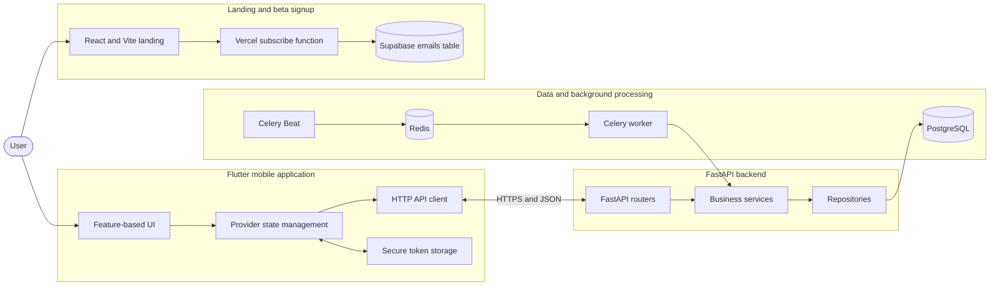
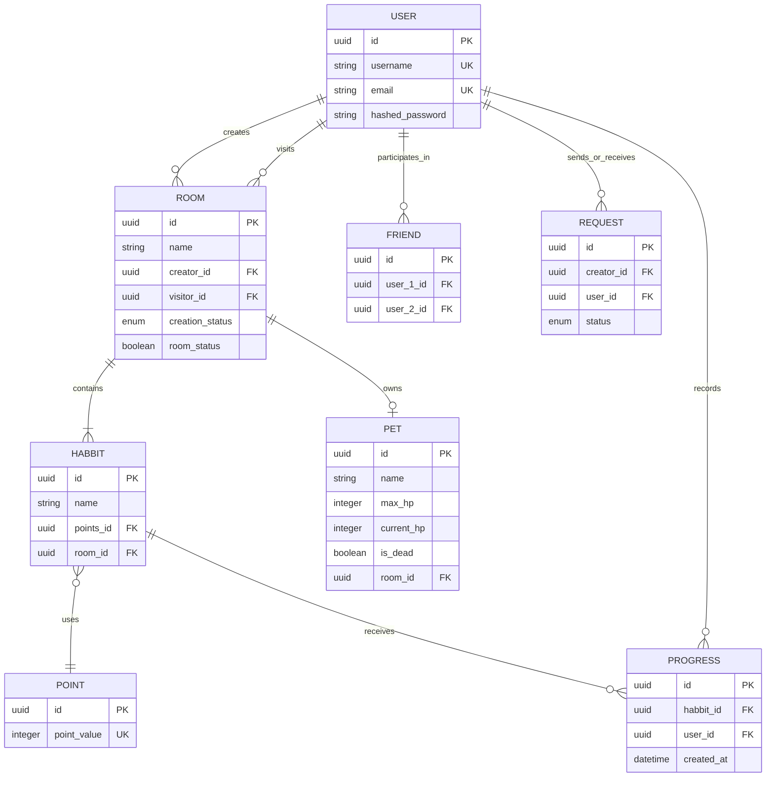
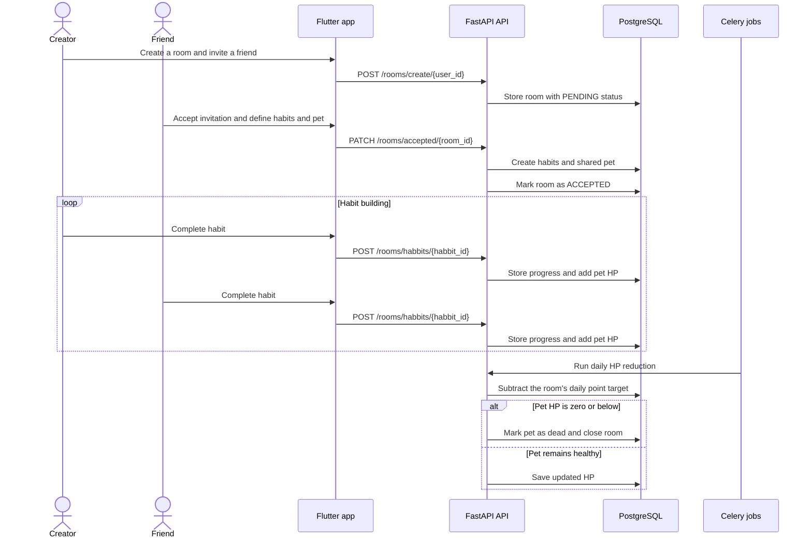

# Zvycha

Zvycha is an open-source habit-building application designed primarily for neurodivergent people. It combines shared rooms based on the **body doubling** method, social accountability, and gamification: two friends build habits together while caring for a shared virtual pet.

> For a detailed overview of the problem, solution, value proposition, team, database design, and product mockups, see the [pitch presentation](docs/pitch_presentation.pdf).

[Join the Zvycha beta](https://zvycha-landing.vercel.app/) · [Pitch presentation](docs/pitch_presentation.pdf) · [Contributing guide](docs/CONTRIBUTING.md) · [Privacy policy](docs/PRIVACY.md) · [OpenAPI specification](backend/openapi.json)

## Table of contents

- [Join the beta](#join-the-beta)
- [Problem and purpose](#problem-and-purpose)
- [How Zvycha solves it](#how-zvycha-solves-it)
- [Features and current status](#features-and-current-status)
- [Architecture](#architecture)
- [Repository structure](#repository-structure)
- [Data model](#data-model)
- [Core workflows](#core-workflows)
- [Technology stack](#technology-stack)
- [Local setup](#local-setup)
- [API](#api)
- [Background jobs](#background-jobs)
- [Development and testing](#development-and-testing)

## Join the beta

Want to try Zvycha? Visit the [Zvycha landing page](https://zvycha-landing.vercel.app/) and submit your email address to receive the beta application when it becomes available.

## Problem and purpose

People with ADHD and other forms of neurodivergence often struggle not only to plan an action, but also to start it and repeat it consistently. Traditional habit trackers usually provide a passive checklist. They offer limited external structure, accountability, or emotional reward, so users may quickly lose engagement.

Zvycha aims to make consistency social, visible, and emotionally meaningful. Instead of completing an isolated checklist, the user gets a partner, a shared space, and a living representation of their progress.

## How Zvycha solves it

The product combines two complementary ideas:

1. **Built-in accountability.** A user creates a shared room with a friend. The presence of another person provides body doubling: external structure that can make it easier to start and remain engaged in an activity.
2. **Reward instead of routine.** Completing habits adds health points to a shared Tamagotchi-style pet. Missed progress causes its health to decrease each day, giving consistency a visible and emotionally meaningful outcome.

Zvycha's unique value proposition is a **dopamine-driven habit tracker**: habits are supported not only by reminders, but also by teamwork and gamified feedback.

## Features and current status

### Implemented in the MVP

- JWT-based registration and sign-in;
- secure session storage in the mobile application;
- user search and friend request management;
- two-person rooms with invitation management;
- between one and five habits per room;
- configurable point values for habits;
- habit completion tracking by user, habit, and room;
- a shared pet whose HP changes according to progress;
- room completion and room or pet renaming;
- a responsive landing page with a beta signup form;
- automatic daily pet HP reduction and weekly progress cleanup.

### Planned

- Pomodoro/focus timer;
- statistics and dashboard;
- extended pet customization and evolution.

These features are part of the product concept but are not implemented in the current codebase.

## Architecture



### Backend

The FastAPI application follows a layered structure:

- `routers` receive HTTP requests and attach authorization and dependencies;
- `services` implement business rules for users, friends, rooms, habits, progress, pets, and points;
- `repository` isolates SQLAlchemy queries;
- `schemas` define Pydantic request and response models;
- `db` contains ORM models, enums, and the asynchronous PostgreSQL session;
- Alembic manages the database schema;
- Celery Beat schedules recurring tasks, while Redis acts as the broker and result backend.

### Mobile frontend

The Flutter client uses a feature-first organization:

- `core` contains the API client, secure storage, theme, navigation, and shared widgets;
- `features/auth` implements welcome, login, signup, and authentication state;
- `features/friends` handles friends, user search, and friend requests;
- `features/rooms` handles rooms, invitations, habits, progress, and pets;
- `features/main` provides the bottom-navigation application shell;
- `Provider` manages state and `GoRouter` manages navigation and authentication redirects.

### Landing page

The React/Vite website introduces the product, displays interactive mobile mockups, and collects emails from potential beta users. The `api/subscribe.ts` serverless endpoint validates an email and inserts it into the Supabase `emails` table. Submitting an existing email is treated as a successful subscription.

## Repository structure

```text
zvycha-app/
├── backend/                 # FastAPI API and background jobs
│   ├── alembic/             # PostgreSQL migrations
│   ├── app/
│   │   ├── core/            # environment-based configuration
│   │   ├── db/              # SQLAlchemy models and session
│   │   ├── repository/      # data access layer
│   │   ├── routers/         # HTTP endpoints
│   │   ├── schemas/         # Pydantic schemas
│   │   ├── services/        # business logic
│   │   └── utils/           # dependencies and JWT helpers
│   ├── docker-compose.yaml  # API, PostgreSQL, and Redis
│   └── openapi.json         # stored API specification
├── frontend/                # Flutter mobile application
│   ├── lib/core/            # infrastructure and UI foundation
│   ├── lib/features/        # auth, friends, rooms, and main
│   ├── assets/              # images and logos
│   └── test/                # Flutter tests
├── landing/                 # React and TypeScript marketing site
│   ├── api/                 # Vercel serverless function
│   ├── public/              # static assets
│   └── src/                 # components, styles, and mockups
└── docs/                    # pitch, privacy, and contribution guide
```

## Data model



- **User** is an account with a unique `email` and `username`.
- **Friend** represents a connection created after accepting a friend request.
- **Request** is a friend request with a `PENDING`, `ACCEPTED`, or `DECLINED` status.
- **Room** is a shared space for its creator and visitor, with invitation and activity states.
- **Habbit** represents a room habit. The `habbit` spelling is used historically in the source code and database.
- **Point** defines an allowed point weight for a habit.
- **Progress** records a user completing a particular habit.
- **Pet** is the room's virtual pet, with `max_hp`, `current_hp`, and `is_dead` fields.

Cascade deletion removes related rooms, habits, pets, progress records, and social connections with their parent entities. A room supports up to five habits, and a user can participate in up to 20 active accepted rooms.

## Core workflows

### Room lifecycle



### Creating a room

1. A user registers or signs in.
2. They find another user and add them as a friend.
3. The user creates a room and invites the friend.
4. The invited user accepts the room, defines between one and five habits, and names the pet.
5. The backend calculates the initial and maximum HP from the selected habit weights, two participants, and a head-start coefficient.

### Progress cycle

1. A participant marks a habit as completed.
2. The backend creates a `Progress` record and adds the habit's point value to the pet's HP.
3. A daily job subtracts the combined daily point target.
4. If HP reaches zero, the pet is marked as dead and the room is closed.
5. Progress records are cleared every Monday.

## Technology stack

| Area | Technologies |
| --- | --- |
| Mobile | Flutter, Dart, Provider, GoRouter, HTTP, Flutter Secure Storage |
| Backend | Python, FastAPI, Pydantic, asynchronous SQLAlchemy, Alembic |
| Data and jobs | PostgreSQL, Redis, Celery, Celery Beat |
| Landing | React 19, TypeScript, Vite, CSS, Vercel Functions |
| Beta signup | Supabase |
| Infrastructure | Docker, Docker Compose, Vercel |

## Local setup

### Prerequisites

- Docker with Docker Compose;
- Flutter SDK compatible with Dart `^3.10.7`;
- Node.js and npm for the landing page;
- a Supabase project only if the beta signup form must be functional.

### 1. Backend

Create `backend/.env`. The existing `backend/.env.sample` is currently only a placeholder.

```env
APP_PORT=8000
APP_HOST=0.0.0.0
APP_RELOAD=true
APP_ORIGINS=["http://localhost:5173"]

APP_DB_USER=postgres
APP_DB_PASSWORD=postgres
APP_DB_HOST=postgres
APP_DB_PORT=5432
APP_DB_NAME=zvycha

APP_JWT_SECRET=replace-with-a-long-random-secret
APP_JWT_ALGORITHM=HS256

APP_REDIS_HOST=redis
APP_REDIS_PORT=6379
APP_DEV_PASSWORD=replace-with-a-developer-password
```

Start the stack:

```bash
cd backend
docker compose up --build
```

The API container automatically applies Alembic migrations and starts FastAPI, the Celery worker, and Celery Beat. The API is available at `http://localhost:8000`, with Swagger UI at `http://localhost:8000/docs`.

> `APP_DEV_PASSWORD` protects the administrative creation of point options through `POST /points/create`. Do not use a weak value outside a local environment.

### 2. Flutter application

Create `frontend/.env` based on `frontend/.env.example`:

```env
BASE_URL=http://localhost:8000
```

When using Android Emulator, the host machine normally needs to be addressed as `http://10.0.2.2:8000`.

```bash
cd frontend
flutter pub get
flutter run
```

Select a connected device or running emulator. The `.env` file is declared as a Flutter asset, so it must exist before building the application.

### 3. Landing page

For local presentation-only development:

```bash
cd landing
npm install
npm run dev
```

To enable beta subscriptions, create `landing/.env` based on `.env.example`:

```env
SUPABASE_URL=https://your-project.supabase.co
SUPABASE_SERVICE_ROLE_KEY=your-service-role-key
```

Supabase must contain an `emails` table with at least a unique `email` field. The service role key is a server-side secret: never expose it through client-side variables or commit the `.env` file.

## API

The complete machine-readable request and response schema is available in [`backend/openapi.json`](backend/openapi.json). After starting the backend, interactive Swagger documentation is available at `/docs` and ReDoc at `/redoc`.

The main endpoint groups are:

| Prefix | Purpose | Authorization |
| --- | --- | --- |
| `/users/login`, `/users/sign_up` | Sign-in and registration | None |
| `/users/user/me` | Profile, user search, friends, and requests | Bearer JWT |
| `/rooms` | Rooms, invitations, habits, progress, and pets | Bearer JWT |
| `/points` | Read habit weights and perform administrative creation | Bearer JWT |

Successful authentication returns an `access_token`. Send it with protected requests as `Authorization: Bearer <token>`.

## Background jobs

Celery Beat runs in the `Europe/Kyiv` timezone:

- every day at 00:00, it recalculates and reduces HP for active pets;
- every Monday at 00:00, it clears progress records.

Redis is used as the Celery broker and result backend. In the current Docker environment, the worker and scheduler run inside the API container.

## Development and testing

```bash
# Flutter static analysis and tests
cd frontend
flutter analyze
flutter test

# Landing lint and production build
cd landing
npm run lint
npm run build
```

The backend currently has no automated test suite. Its endpoints can be checked through Swagger UI or an OpenAPI client. Before contributing, read [CONTRIBUTING.md](docs/CONTRIBUTING.md).

## Team

According to the [pitch presentation](docs/pitch_presentation.pdf), Zvycha was created by the Empat × CatLovers team:

- **Anna Kuts** — full-stack development, UI/UX, landing development, and mobile authentication flows;
- **Yevheniia Dibrova** — mobile development and UI/UX;
- **Valeriia Hundiak** — backend development and database design.

## License

This project is distributed under the terms of the [LICENSE](LICENSE) file.
